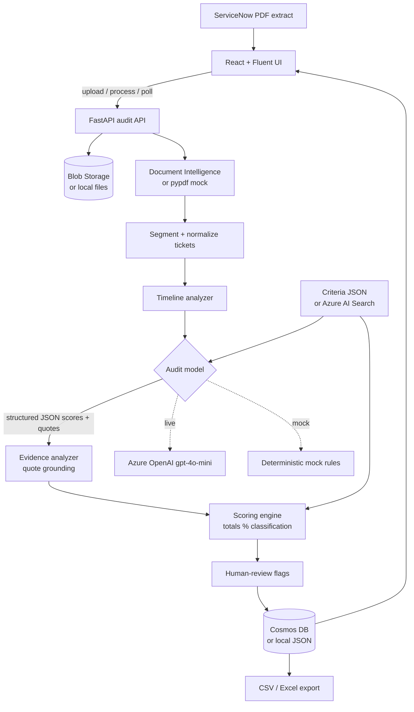
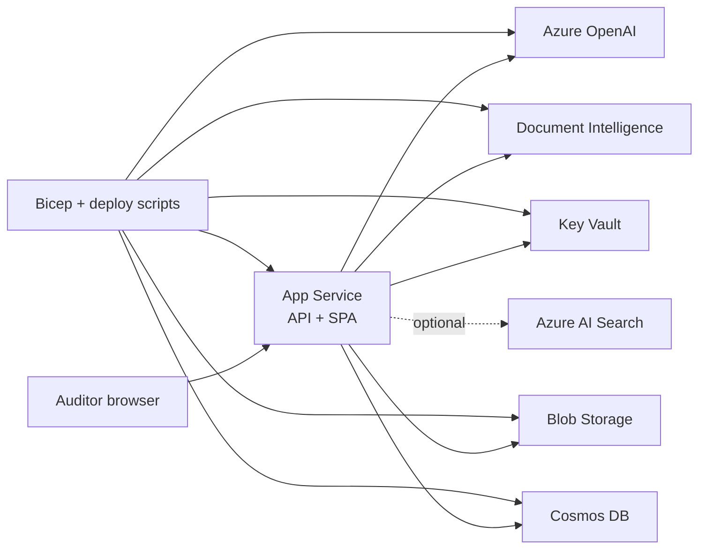

# AI Based Incident Audit Tool

Audits the quality of ServiceNow incident extracts. Upload a PDF, score each ticket on three measures, and review the evidence behind every score.

The model does not own the result. It proposes a 1–5 score and quotes from the ticket. A deterministic scoring engine checks the range, drops quotes that are not in the ticket, and computes the total, percentage, and classification.

Local runs default to `USE_MOCK_AZURE=true`. Mock and live Azure clients implement the same interfaces. No Azure credentials are required for the UI or the tests.

## Technical architecture

End-to-end flow (UI → API → Azure AI → deterministic scoring → store → UI):



Azure AI deployment topology:



**Control flow for one audit job**

1. `POST /api/audits/upload` (or `/sample`) stores the PDF and creates a job (`Uploaded`).
2. `POST /api/audits/{job_id}/process` runs Extracting → Tickets identified → Auditing → Completed / Failed.
3. Each ticket is scored independently; a second audit of the same ticket id increments `audit_version`.
4. The UI polls the job, then reads dashboard / ticket APIs. Overrides and “Accept AI scores” go through ticket review endpoints.

## Technologies and AI tools

### Application stack

| Layer | Technology | Role |
| --- | --- | --- |
| API | Python 3.12, FastAPI, Uvicorn | Upload jobs, audit orchestration, REST API, optional SPA hosting |
| Models / config | Pydantic, pydantic-settings | Request/response schemas, environment configuration |
| Scoring | Deterministic scoring engine (app code) | Owns totals, percentage, classification; rejects out-of-range scores and unsupported quotes |
| PDF (local / mock) | pypdf | Text-layer extraction when Azure Document Intelligence is mocked |
| Exports | openpyxl | CSV / Excel audit exports |
| UI | React 19, TypeScript, Vite | Audit upload, job progress, dashboard, ticket review |
| UI components | Fluent UI (`@fluentui/react-components`) | Buttons, forms, badges, layout primitives |
| Routing | React Router | New audit, dashboard, history, ticket detail |
| Tests | pytest, httpx | API and scoring tests against mock Azure clients |

### Azure AI and cloud services (live mode)

| Service | How it is used |
| --- | --- |
| **Azure OpenAI** | Chat completions with structured JSON for per-measure scores (1–5), confidence, evidence quotes, strengths, gaps, and recommendations. Default deployment: `gpt-4o-mini`. |
| **Azure AI Document Intelligence** | `prebuilt-layout` model extracts text and pages from ServiceNow PDF extracts before segmentation. |
| **Azure AI Search** *(optional)* | Retrieves audit criteria / rubric. If unset, the app loads `backend/app/config/audit_criteria.json`. |
| **Azure Blob Storage** | Stores uploaded PDF extracts. |
| **Azure Cosmos DB** | Persists audit jobs and results (SQL API, partition key `/ticket_id`). |
| **Azure Key Vault** | Holds OpenAI, Document Intelligence, Storage, and Cosmos secrets; App Service uses Key Vault references. |
| **Azure Container Registry** | Hosts the Docker image for App Service (container deploy path). |
| **Azure App Service** | Runs the API + built React SPA (Linux container or Python zip deploy). |
| **Managed Identity** | Optional auth for OpenAI, Document Intelligence, Blob, and Cosmos instead of API keys (`AZURE_USE_MANAGED_IDENTITY=true`). |

Live SDK packages (install via `backend/requirements-azure.txt`): `openai` (AzureOpenAI client), `azure-ai-documentintelligence`, `azure-storage-blob`, `azure-cosmos`, `azure-search-documents`, `azure-identity`, `azure-core`.

### Infrastructure as code

| Tool | Purpose |
| --- | --- |
| **Bicep** (`infrastructure/bicep/`) | Provisions OpenAI (with model deployment), Document Intelligence, Storage, Cosmos, Key Vault, App Service, optional AI Search, and RBAC |
| **Docker** | Multi-stage image: Vite build → FastAPI serving API + static UI |
| **Azure CLI scripts** | `scripts/deploy-azure.sh` (ACR + container) and `scripts/deploy-azure-zip.sh` (Python zip) |

### How AI fits the audit pipeline

1. **Document Intelligence** (or pypdf in mock mode) turns the PDF into page text.
2. App code **segments and normalizes** ServiceNow tickets (`INCIDENT NUMBER:` / `Number:`).
3. **Azure OpenAI** (or deterministic mock rules) proposes measure-level scores and evidence quotes from the structured ticket.
4. An **evidence analyzer** drops quotes that are not present in the ticket.
5. The **scoring engine** validates ranges and computes overall score, percentage, and classification — the model never owns the final percentage.

## ML / AI algorithms and logic

This product is **not** a classical trained ML classifier (no gradient boosting, neural fine-tuning, or offline label training in-repo). Quality judgment comes from a **large language model (LLM)** guided by a fixed rubric, then **deterministic post-processing** that owns numbers and grounds evidence.

### 1. Generative LLM evaluation (live Azure OpenAI)

| Technique | Implementation |
| --- | --- |
| **Prompted rubric scoring** | System + user prompts (`audit_system_prompt.txt`, `audit_user_prompt.txt`) instruct the model to score only documented ticket facts against `audit_criteria.json`. |
| **Structured output** | Chat completion with JSON schema / `json_object` response format (`LlmAuditEvaluation`). Temperature `0` for stable scoring. |
| **Per-measure ordinal scores** | Integer scores 1–5 for `user_engagement`, `issue_diagnosis`, `solutioning`, plus confidence ∈ [0, 1], evidence quotes, strengths, gaps, recommendation. |
| **Anti-hallucination rules (prompt logic)** | No invented facts; symptom ≠ root cause; assignment ≠ ownership; missing data must be stated as missing; conflicts must be reported, not resolved. |
| **Model does not own totals** | Any `overall_score` / `percentage` / `classification` from the model is discarded; the app recomputes them. |

Default live model: **Azure OpenAI `gpt-4o-mini`** (configurable deployment).

### 2. Deterministic mock auditor (local / tests)

When `USE_MOCK_AZURE=true`, `MockAuditModel` + `mock_rules.py` replace the LLM with **hand-authored heuristics** over ticket text (keyword / pattern signals). Examples:

- **Engagement:** detect acknowledgement, investigation, progress, blocker, next step, and resolution communication; apply a **timeliness penalty** when first update and longest gap both exceed priority SLAs (P1 1h, P2 4h, P3 8h, P4 24h).
- **Diagnosis:** require what / where / why; treat phrases like “pipeline failed” as symptoms; flag conflicting `Root cause:` statements.
- **Solutioning:** require action + named actor + validation; `Assigned to` alone does not count as ownership.

This keeps UI and pytest runs offline and reproducible without calling Azure.

### 3. Evidence grounding (deterministic)

`EvidenceAnalyzer` is a **quote-verification** step (not ML):

1. Build a ticket corpus from all extracted fields.
2. Normalize whitespace and case; require quotes ≥ **12 characters**.
3. Mark evidence **Supported** only if the normalized quote is a substring of the corpus.
4. Drop invented timestamps / pages; mark unsupported items and add flags (`unsupported evidence`, `insufficient evidence`).
5. Cap confidence at **0.5** when unsupported evidence appears.

### 4. Scoring engine (deterministic math)

Owned entirely by application code (`ScoringEngine`):

```text
total     = Σ (scoreᵢ × weightᵢ)
maximum   = Σ (max_scoreᵢ × weightᵢ)     # default max_score = 5, weight = 1 → maximum 15
percentage = round_half_up(total / maximum × 100, 2)
```

**Classification bands** (from criteria JSON):

| Percentage | Label |
| --- | --- |
| 90–100 | Excellent |
| 75–89.99 | Good |
| 60–74.99 | Fair |
| 0–59.99 | Needs Improvement |

Out-of-range scores raise errors; weights and bands are configurable in `audit_criteria.json` without changing model code.

### 5. Confidence labeling and human-review logic

| Confidence | Label |
| --- | --- |
| ≥ 0.85 | High confidence |
| 0.70–0.84 | Medium confidence |
| &lt; 0.70 | Requires human review |

`AuditEngine` also flags human review for: insufficient / unsupported evidence, conflicting information, unclear root cause, missing resolution ownership, low AI confidence, or incomplete extracted structure. Auditors can **override** a measure score; `ai_score` is preserved and totals are recomputed from the final scores.

### 6. Document and ticket processing (rules, not ML)

| Step | Logic |
| --- | --- |
| PDF text | Azure Document Intelligence `prebuilt-layout`, or pypdf text layer in mock mode |
| Segmentation | Split on `INCIDENT NUMBER:` / `Number:` patterns |
| Normalization | Map ServiceNow fields; leave missing fields empty (no imputation) |
| Timeline | Parse work notes / comments into ordered events for engagement and review |

### Design principle

**LLM proposes → rules verify → engine scores.** Generative AI supplies judgment and natural-language evidence; deterministic algorithms enforce grounding, arithmetic, classification, and review gates so results stay auditable and reproducible for a fixed criteria / prompt / model version.

## Scores and rubric (scales 3–5)

Each ticket is scored on **three criteria**. Every criterion uses an integer score **1–5**. Scores **3, 4, and 5** are the primary quality band (Fair / Good / Excellent). Scores **1 and 2** are system-defined extensions for severe gaps and are still shown in the UI.

| Criterion (`measure_id`) | Question the auditor answers |
| --- | --- |
| User engagement (`user_engagement`) | Were investigation updates timely and meaningful? |
| Issue diagnosis (`issue_diagnosis`) | What caused it, where, and why? |
| Solutioning (`solutioning`) | What was done, who did it, and how was recovery checked? |

Source of truth for wording and weights: [`backend/app/config/audit_criteria.json`](backend/app/config/audit_criteria.json).

### How a 3 / 4 / 5 is chosen

The model (or mock rules) maps ticket evidence to a level. Scoring is **content-based**, not field-presence-based: an empty or generic note does not earn a high score. Evidence quotes must appear in the ticket after grounding.

#### 1. User engagement & investigation handling

Judges **quality and timeliness** of work notes / comments — not comment count alone. Considers elapsed time, priority, meaningfulness, progress visibility, and gaps. Timeliness expectations (used by mock rules; also informed by the rubric): P1 1h, P2 4h, P3 8h, P4 24h for first update / gap penalties.

| Score | Label | When to award (primary rubric 3–5) |
| --- | --- | --- |
| **5** | Excellent | Clear, timely updates with continuous progress visibility covering acknowledgement, investigation, meaningful progress, blockers, next steps, **and** resolution communication. |
| **4** | Good | Regular updates with adequate investigation progress. **Minor** gaps in timing or detail are allowed. |
| **3** | Fair | Limited updates with only **basic** investigation progress — infrequent, generic, or lacking meaningful investigation detail. |
| 2 | Very limited *(extension)* | Major gaps in updates or progress visibility. |
| 1 | No meaningful updates *(extension)* | No meaningful investigation communication; absence of notes is **not** proof that people were informed. |

**3 vs 4 vs 5 (engagement):**  
- **3** = some trail exists but it is thin or generic.  
- **4** = a usable investigation narrative with small holes.  
- **5** = full lifecycle visibility (ack → investigate → progress → blockers → next steps → resolve) with timely updates.

#### 2. Issue diagnosis

The ticket must answer **what** caused the issue, **where** it occurred, and **why**. Distinguish symptom, immediate cause, contributing factor, root cause, affected component, and business process. A symptom such as “pipeline failed” is **not** a root cause. Conflicting `Root cause:` statements are a conflict, not a license to pick one side.

| Score | Label | When to award (primary rubric 3–5) |
| --- | --- | --- |
| **5** | Excellent | Clearly answers what, where, and why, and identifies the **root cause**. |
| **4** | Good | Answers **most** diagnostic questions with sufficient analysis (minor missing nuance OK). |
| **3** | Fair | **Partial** diagnosis with limited root-cause detail (some of what/where/why present, but weak). |
| 2 | Limited *(extension)* | Key diagnostic dimensions missing, or diagnostic statements conflict. |
| 1 | Not documented *(extension)* | No meaningful diagnosis or root-cause analysis. |

**3 vs 4 vs 5 (diagnosis):**  
- **3** = partial story (e.g. component named but not why, or symptom-heavy wording).  
- **4** = solid analysis missing one secondary detail.  
- **5** = explicit root cause with location and causal “why,” grounded in ticket text.

#### 3. Solutioning

The resolution should say **what** was done, **who** performed it, and **how** recovery was validated. Look for action, named person/team, technical change, validation / recovery evidence, and preventive action when applicable. **Do not** infer ownership from Assignment group or Assigned to.

| Score | Label | When to award (primary rubric 3–5) |
| --- | --- | --- |
| **5** | Excellent | Complete resolution details, **explicit ownership**, and **validation** of the fix. |
| **4** | Good | Resolution and actions documented, with **minor** gaps (e.g. incomplete validation). |
| **3** | Fair | Basic resolution with limited detail or ownership. |
| 2 | Partial *(extension)* | Only partly documented; important info such as who performed the fix is missing. |
| 1 | Missing *(extension)* | Resolution / action taken is missing or unclear. |

**3 vs 4 vs 5 (solutioning):**  
- **3** = something was done, but ownership and/or validation are thin.  
- **4** = clear action path with a small gap (often validation).  
- **5** = named actor + concrete change + evidence of recovery.

### Totals and overall classification

After each measure has a final integer score (AI or auditor override):

```text
total      = Σ (scoreᵢ × weightᵢ)          # default weights = 1
maximum    = Σ (5 × weightᵢ)               # default maximum = 15
percentage = round_half_up(total / maximum × 100, 2)
```

| Percentage | Overall classification |
| --- | --- |
| 90–100 | Excellent |
| 75–89.99 | Good |
| 60–74.99 | Fair |
| 0–59.99 | Needs Improvement |

Example (default weights): scores **5 + 4 + 3** → total **12** / 15 → **80%** → **Good**.  
Model-returned overall totals are ignored; only the scoring engine’s result is stored (`totals_computed_by = scoring_engine`).

## Run locally

Requirements: Python 3.12 and Node 22. Local default is **mock Azure** (`USE_MOCK_AZURE=true`) — no Azure credentials needed.

### VS Code / Cursor

1. Clone the repo and open the folder in VS Code (or Cursor): **File → Open Folder…**
2. Install recommended extensions when prompted (Python / debugpy).
3. **Terminal → Run Task… → `Install all`** (creates `.venv`, installs Python + npm deps, builds the sample PDF).
4. **Terminal → Run Task… → `Run locally (API + UI)`**  
   Or use **Run and Debug → `Full stack: API + UI`**.
5. Open [http://127.0.0.1:43123](http://127.0.0.1:43123).

| Service | URL |
| --- | --- |
| UI | http://127.0.0.1:43123 |
| API health | http://127.0.0.1:43124/api/health |
| OpenAPI docs | http://127.0.0.1:43124/docs |

On the New audit page: **Load sample extract** → **Start audit** (eight sample incidents).

Tasks live in [`.vscode/tasks.json`](.vscode/tasks.json). Launch configs live in [`.vscode/launch.json`](.vscode/launch.json).

### Terminal (two shells)

```bash
python3 -m venv .venv
.venv/bin/pip install -r backend/requirements.txt
.venv/bin/python sample-data/build_pdf.py

cd backend
USE_MOCK_AZURE=true ../.venv/bin/uvicorn app.main:app --host 0.0.0.0 --port 43124
```

In another shell:

```bash
cd frontend
npm install
npm run dev
```

Open [http://127.0.0.1:43123](http://127.0.0.1:43123). The Vite server proxies `/api` to port 43124.

Optional: set `AUDIT_STAGE_DELAY_MS=400` before starting the API if you want the status stepper to pause on each stage.

Copy `backend/.env.example` if you want a local env file. Secrets stay empty in mock mode. Live Azure settings are documented in `docs/deployment.md`. Install `backend/requirements-azure.txt` only when `USE_MOCK_AZURE=false`.

## Deploy to Azure AI

Live mode uses **Azure OpenAI**, **Document Intelligence**, **Blob Storage**, and **Cosmos DB**. Managed identity or Key Vault–backed API keys are supported.

```bash
# After az login (or set AZURE_CLIENT_ID / AZURE_CLIENT_SECRET / AZURE_TENANT_ID)
export AZURE_SUBSCRIPTION_ID=<subscription>
export AZURE_RESOURCE_GROUP=rg-incaudit
./scripts/deploy-azure.sh          # Docker + ACR + App Service
# or, without Docker:
./scripts/deploy-azure-zip.sh      # zip deploy Python App Service
```

Details: [`docs/deployment.md`](docs/deployment.md).

## Tests

```bash
.venv/bin/pytest
```

Tests use the mock clients, local files, and the sample extract. They do not call the network and do not need Azure credentials.

## Layout

- `backend/` FastAPI application, scoring engine, mock and Azure adapters
- `frontend/` React, TypeScript, Vite, Fluent UI
- `sample-data/` eight-ticket extract, PDF, and expected score ranges
- `infrastructure/bicep/` Azure AI + App Service deployment
- `scripts/deploy-azure.sh` / `deploy-azure-zip.sh` deploy helpers
- `Dockerfile` single-container API + SPA image
- `docs/` architecture, rubric, API, deployment, security, cost, and roadmap

## Sample incidents

| Ticket | What it demonstrates | Mock result |
| --- | --- | --- |
| INC1001 | Complete updates, cause, owner, and validation | 15/15 · 100% · Excellent |
| INC1002 | Regular updates, minor gaps, no formal validation | 12/15 · 80% · Good |
| INC1003 | Thin updates and a restart with no named owner | 9/15 · 60% · Fair |
| INC1004 | Closed with no notes, diagnosis, or resolution | 3/15 · 20% · Needs Improvement |
| INC1005 | Handling is present, but the text only says the pipeline failed | 10/15 · 66.67% · Fair |
| INC1006 | Cause and validation, but nobody is named as the actor | 11/15 · 73.33% · Fair |
| INC1007 | Cause and a named fix, with an empty work-note trail | 11/15 · 73.33% · Fair |
| INC1008 | Two different root-cause statements | 10/15 · 66.67% · Fair |

Assignment is not treated as ownership. A symptom is not treated as a root cause.
