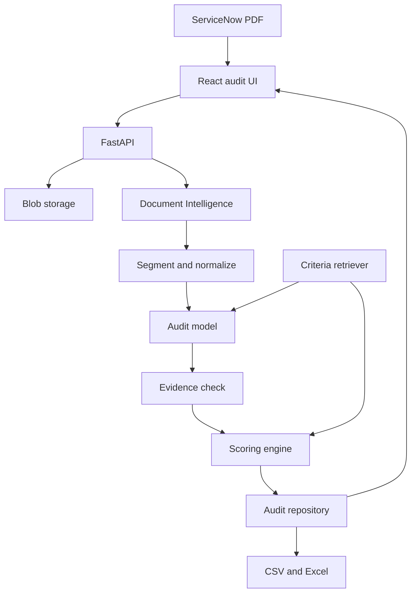

# Architecture

The UI never talks to a database. It calls the API. Business rules live in services and the audit package, not in route functions.

## Replaceable edges

| Concern | Interface | Mock | Live |
| --- | --- | --- | --- |
| PDF text | `DocumentClient` | pypdf text layer | Azure Document Intelligence prebuilt-layout |
| Per-measure evaluation | `AuditModel` | Deterministic rules over ticket text | Azure OpenAI structured JSON |
| Rubric | `CriteriaRetriever` | `audit_criteria.json` | Azure AI Search, with the JSON file as fallback |
| Files | `BlobStore` | Local directory | Azure Blob Storage |
| Results | `AuditRepository` | JSON file | Cosmos DB, partition key `ticket_id` |

`USE_MOCK_AZURE=true` selects the mock column. Live mode (`USE_MOCK_AZURE=false`) uses Azure OpenAI, Document Intelligence, Blob Storage, and Cosmos DB with API keys (Key Vault references) or managed identity.

Deploy with `./scripts/deploy-azure.sh` (Docker + ACR + App Service) or `./scripts/deploy-azure-zip.sh` (Python zip deploy). Details: [`deployment.md`](deployment.md).

## Request path

1. `POST /api/audits/upload` stores the PDF and creates a job in status Uploaded.
2. `POST /api/audits/{job_id}/process` moves the job through Extracting, Tickets identified, Auditing, and Completed or Failed.
3. The segmenter splits records on `INCIDENT NUMBER:` or `Number:`. The normalizer leaves missing ServiceNow fields empty.
4. The model returns three measure objects: score, confidence, evidence, strengths, gaps, recommendation.
5. The evidence analyzer rejects quotes that are not in the ticket and timestamps or pages that the ticket does not contain.
6. The scoring engine rejects out-of-range scores and computes total, percentage, and classification from the configured weights.
7. The repository stores the full document, including the ticket snapshot, so an older audit can be read again.
8. A second audit of the same ticket id increments `audit_version`. The dashboard uses the latest version.

## What the model is allowed to see

The user prompt receives the structured ticket fields and the timeline: identifiers, descriptions, priority, assignment, dates, notes, cause, and resolution. It does not receive the raw PDF bytes. The local mock never leaves the process.

Logs record job id, ticket id, stage, status, timing, retry count, and token usage when a live call returns it. Ticket bodies are dropped even if a caller passes them.

## Human review

Review is required when evidence is insufficient, a quote was rejected, diagnostic statements conflict, the diagnosis score is 1 or 2, resolution ownership is missing, confidence is below 0.70, or the extracted structure is sparse.

An override stores the auditor score, comments, and reason on the measure. `ai_score` is left as first written. The final score becomes the auditor score, and the engine recomputes the total and classification. Accepting the AI scores records a review without changing numbers.
